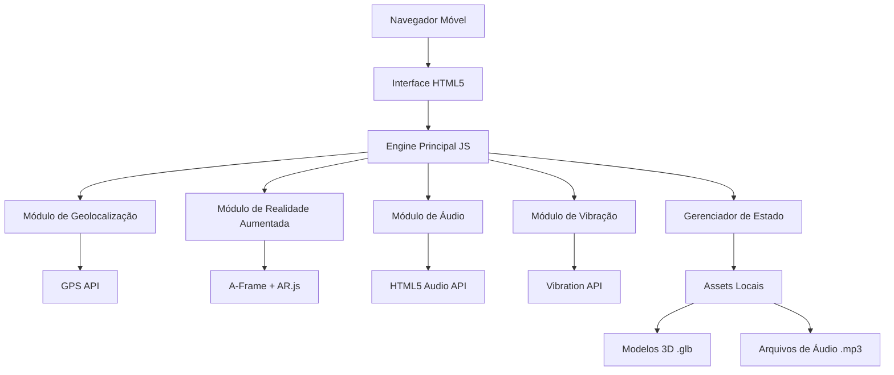

# Documento de Design

## Visão Geral

O "Stranger Things: Projeto Pedra Branca Invertida" é uma aplicação WebAR que combina geolocalização GPS, realidade aumentada e elementos multimídia para criar uma experiência imersiva baseada na série Stranger Things. O jogo utiliza tecnologias web modernas para funcionar diretamente no navegador móvel sem necessidade de instalação.

## Arquitetura

### Arquitetura Geral do Sistema



### Arquitetura de Componentes

O sistema será estruturado em módulos independentes que se comunicam através de um gerenciador de estado central:

1. **Core Engine**: Coordena todos os módulos e gerencia o ciclo de vida da aplicação
2. **Location Manager**: Gerencia GPS e cálculos de proximidade
3. **AR Manager**: Controla elementos de realidade aumentada
4. **Audio Manager**: Gerencia reprodução e controle de áudio
5. **Haptic Manager**: Controla feedback tátil
6. **UI Manager**: Gerencia interface do usuário e estados visuais
7. **Mission Manager**: Controla lógica das missões e progressão

## Componentes e Interfaces

### 1. Core Engine (GameEngine)

```javascript
class GameEngine {
    constructor()
    init()
    start()
    update()
    handlePermissions()
    onLocationUpdate(position)
    onMissionActivated(mission)
    onMissionCompleted(mission)
}
```

**Responsabilidades:**
- Inicialização da aplicação
- Coordenação entre módulos
- Gerenciamento de permissões
- Loop principal do jogo

### 2. Location Manager (LocationManager)

```javascript
class LocationManager {
    constructor(gameEngine)
    requestPermission()
    startTracking()
    stopTracking()
    calculateDistance(lat1, lon1, lat2, lon2)
    checkProximity()
    getCurrentPosition()
}
```

**Responsabilidades:**
- Solicitação de permissões GPS
- Rastreamento contínuo de localização
- Cálculo de distâncias usando fórmula de Haversine
- Detecção de proximidade com pontos de interesse

### 3. AR Manager (ARManager)

```javascript
class ARManager {
    constructor()
    init()
    requestCameraPermission()
    loadModel(modelPath, position)
    removeModel(modelId)
    isARSupported()
    setupScene()
}
```

**Responsabilidades:**
- Inicialização do A-Frame e AR.js
- Gerenciamento de permissões de câmera
- Carregamento e posicionamento de modelos 3D
- Controle da cena AR

### 4. Audio Manager (AudioManager)

```javascript
class AudioManager {
    constructor()
    loadAudio(audioPath)
    playAudio(audioId)
    pauseAudio(audioId)
    stopAudio(audioId)
    setVolume(volume)
    isPlaying(audioId)
}
```

**Responsabilidades:**
- Pré-carregamento de arquivos de áudio
- Controle de reprodução
- Gerenciamento de volume
- Prevenção de sobreposição de áudios

### 5. Haptic Manager (HapticManager)

```javascript
class HapticManager {
    constructor()
    isSupported()
    vibrateProximity(distance)
    vibrateActivation()
    stopVibration()
}
```

**Responsabilidades:**
- Verificação de suporte à vibração
- Padrões de vibração baseados em proximidade
- Controle de intensidade

### 6. Mission Manager (MissionManager)

```javascript
class MissionManager {
    constructor(gameEngine)
    loadMissions()
    checkMissionActivation(position)
    activateMission(missionId)
    completeMission(missionId)
    getProgress()
    isAllCompleted()
}
```

**Responsabilidades:**
- Carregamento de dados das missões
- Lógica de ativação baseada em localização
- Controle de progresso
- Persistência de estado

## Modelos de Dados

### Mission Data Structure

```javascript
const missions = [
    {
        id: 'casa',
        name: 'Casa',
        coordinates: {
            lat: -27.630876175110835,
            lng: -48.67969706159946
        },
        audioFile: 'audios/1 - Casa.mp3',
        arModel: null,
        activationRadius: 30,
        description: 'Ponto inicial da jornada',
        completed: false
    },
    {
        id: 'lago',
        name: 'Lago',
        coordinates: {
            lat: -27.629651561773642,
            lng: -48.68112592253786
        },
        audioFile: 'audios/3 - Lago.mp3',
        arModel: 'models/portal.glb',
        activationRadius: 30,
        description: 'Portal para o Mundo Invertido',
        completed: false
    }
    // ... outras missões
];
```

### Game State Structure

```javascript
const gameState = {
    isInitialized: false,
    permissions: {
        location: false,
        camera: false
    },
    currentPosition: {
        lat: null,
        lng: null,
        accuracy: null
    },
    activeMission: null,
    completedMissions: [],
    totalMissions: 7,
    isARActive: false,
    audioPlaying: null
};
```

## Tratamento de Erros

### Estratégias de Error Handling

1. **Permissões Negadas:**
   - GPS: Exibir mensagem explicativa e botão para tentar novamente
   - Câmera: Continuar sem AR, mostrar aviso

2. **Conectividade:**
   - Assets pré-carregados para funcionamento offline
   - Cache de recursos críticos

3. **Compatibilidade:**
   - Detecção de suporte WebXR
   - Fallback para versão sem AR

4. **Precisão GPS:**
   - Tolerância para GPS impreciso
   - Opção manual de ativação se necessário

### Error Recovery

```javascript
class ErrorHandler {
    static handleLocationError(error) {
        switch(error.code) {
            case error.PERMISSION_DENIED:
                return "Permissão de localização negada";
            case error.POSITION_UNAVAILABLE:
                return "Localização indisponível";
            case error.TIMEOUT:
                return "Timeout na localização";
        }
    }
    
    static handleARError(error) {
        console.warn("AR não disponível:", error);
        // Continuar sem AR
    }
}
```

## Estratégia de Testes

### Testes Unitários
- Cálculos de distância (fórmula de Haversine)
- Lógica de ativação de missões
- Gerenciamento de estado
- Validação de coordenadas

### Testes de Integração
- Fluxo completo de uma missão
- Interação entre módulos
- Carregamento de assets

### Testes de Dispositivo
- Teste em Samsung Galaxy S20 FE (dispositivo alvo)
- Teste de permissões
- Teste de precisão GPS
- Teste de performance AR

### Testes de Usabilidade
- Navegação intuitiva
- Feedback visual adequado
- Responsividade da interface
- Acessibilidade básica

## Considerações de Performance

### Otimizações

1. **Assets:**
   - Compressão de modelos 3D
   - Otimização de arquivos de áudio
   - Lazy loading quando possível

2. **GPS:**
   - Throttling de updates de localização
   - Cache de cálculos de distância

3. **AR:**
   - Renderização otimizada
   - Cleanup de modelos não utilizados

4. **Memória:**
   - Gerenciamento de lifecycle dos componentes
   - Cleanup de event listeners

### Métricas de Performance
- Tempo de carregamento inicial < 3 segundos
- Atualização de GPS a cada 2 segundos
- Renderização AR a 30 FPS mínimo
- Uso de memória < 100MB

## Segurança e Privacidade

### Proteção de Dados
- Localização processada apenas localmente
- Não envio de dados para servidores externos
- Cache local seguro

### Permissões
- Solicitação explícita de permissões
- Explicação clara do uso de cada permissão
- Funcionamento degradado se permissões negadas

## Deployment e Distribuição

### Hospedagem
- GitHub Pages ou Netlify para hosting estático
- HTTPS obrigatório para APIs de localização
- CDN para assets quando necessário

### Compatibilidade
- Chrome Android (primário)
- Firefox Mobile (secundário)
- Safari iOS (limitado, sem WebXR completo)

### Cache Strategy
- Service Worker para cache offline
- Versionamento de assets
- Update automático quando disponível